# Semantic Segmentation

## Overview
This repository contains the work I did within **Project #12 of Udacity's Self-Driving Car Nanodegree Program** (second project of third term). In this project, objective is to label the pixels of images which represent the road, using a Fully Convolutional Network (FCN). Programming language is Python.

## Repository content
The repository includes the following files:

 - source code :
	 - `main.py` : main function used for loading pretrained net, building FCN, training and testing
	 - `helper.py`:  useful functions for generating batch of images, producing output images...
	- `project_test.py`: script containing functions to check `main.py`
- `/results` : this folder contains the output images  

## FCN architecture

The FCN architecture that we implement comes from the following reference paper (cited as [LONG] hereafter and available [here]( https://people.eecs.berkeley.edu/~jonlong/long_shelhamer_fcn.pdf)):

    Fully Convolutional Models for Semantic Segmentation
    Jonathan Long, Evan Shelhamer, Trevor Darrell
    CVPR 2015
    arXiv:1411.4038

The net is built on top of the VGG 16-layer net. The latter is a very efficient neural network for image classification. Its architecture is represented on the next figure. It is compound of 16 layers (only convolution, pool and dense).

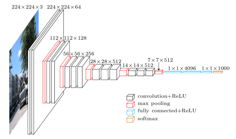

 However it has to be modified to get a prediction at each pixel of the image, instead of a prediction for the whole image.
The steps for modifying VGG-16 net are : 
-	Replace the first two fully connected layers by convolutional layers (to get a FCN) (*)
-	Remove last FC layer, because it has 1000 outputs and for this project we only want to classify as road / non road (*)
-	Add a 1x1-convolution layer with output dimension equal to 2
-	Add a deconvolution layer, which perform the upsampling of the coarse outputs to pixel-dense outputs

(*) -> these steps are already performed in the VGG-16 model we take as input. 

A further and essential improvement to get a fine segmentation classification is to add skips to this architecture. This consists in combining the final prediction layer, whose accuracy is coarse, with lower layers with finer strides. This is represented on the next figure, extracted from the reference paper.

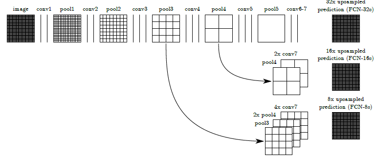

**Figure. FCN architecture (taken from [LONG])**

Multiple skip architectures are possible (three different ones are presented in [LONG]). The author’s obtained the best performance with the one called FCN-8s. To build this net, the following steps must be performed :
1) 2x-upsampling of conv7
2) 1x1 conv of pool 4 (to output two classes)
3) add of outputs of 1) and 2)
4) 2x-upsampling of 3)
5) 1x1 conv of pool 3 (to output two classes)
6) add of outputs of 4) and 5)
7) 8x-upsampling of 6)

In addition:
- L2-regularization is added to each of the new layers. 
- Authors of [LONG] on their [Github page](https://github.com/shelhamer/fcn.berkeleyvision.org) mention that they apply scaling to pool4 and pool3 layers to improve performance. I chose to apply the same scaling factors as them (values can be found in this [prototxt file](https://github.com/shelhamer/fcn.berkeleyvision.org/blob/master/voc-fcn8s-atonce/train.prototxt)) which are equal to 0.0001 for pool 3 and 0.01 for pool4.
- No class balancing was implemented because [LONG] states that it does not bring additional performance
- I chose to to perform training on the whole image rather than on image patches. This is easier to perform and, furthermore, [LONG] observed that patch sampling does not improve performance.

The network was then trained on a GPU on AWS (g3.4x-large instance). Only the weights of the added layers are trainable (the ones from VGG-16 are frozen).
I chose the following set of hyperparameters:
-	Optimizer: Adam
-	Keep probability : 0.5
-	Learning rate: {1e-5, 1e-4, 1e-3, 1e-2}
-	L2-regularization : {1e-3, 1e-2}
-	Initialization of weights with a truncated normal distribution of standard deviation equal to 0.01

### Results
It takes roughly 15 minutes on the AWS instance to train the network for 20 iterations.
In the following table, I give the training loss I obtained for the various configurations I tested, and a qualitative assessment of the result:

| Id | Learn rate|Keep prob|L2-reg|Scaling|Batch size| Training loss after, 5 /10 /15 / 20 iterations| Quality of segmentation|
|:-----:|:-----:|:-----:|:-----:|:-----:|:-----:|:-----:|:--:|
|1|0.01|0.5|0.001|Yes|4| 4.6 / 578.8 / 5.3 / 11.7 | Very bad|
|2|0.001|0.5|0.001|Yes|8| 0.249 / 0.177 / 0.261 / 0.164 | Quite good |
|3|0.0001|0.5|0.001|Yes|8| 0.343 / 0.227 / 0.161 / 0.184 | Good |
|4|0.00001|0.5|0.001|Yes|8| 0.861 / 0.486 / 0.329 / 0.320 | Very similar to #3 |
|5|0.00001|0.5|0.0|Yes|8| 0.355 / 0.167 / 0.073 / 0.046 | Some accuracy is lost wrt #4|
|6|0.00001|0.5|0.001|No|8| 0.709 / 0.390 / 0.334 / 0.361 |Idem  |
|7|0.00001|0.5|0.01|Yes|8| 0.994 / 0.507 / 0.462 / 0.309  | Worse than #6 |
|8|0.0001|0.5|0.01|Yes|8| 0.359 / 0.152 / 0.186 / 0.129  | Very close to #3 |

To sum-up results, we observe that scaling and L2-regularization (factor=0.001) bring some further improvement to the segmentation. The performance is almost the same for learning rates equal to 0.001 and 0.0001.

Finally I replayed configuration #3 with 40 epochs. Final loss was 0.12. Some exemples of the resulting segmented images are given below:

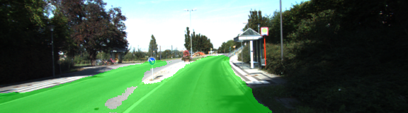
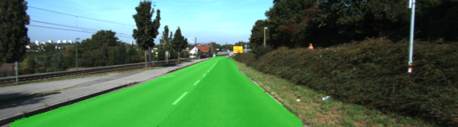
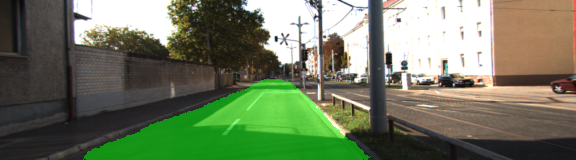
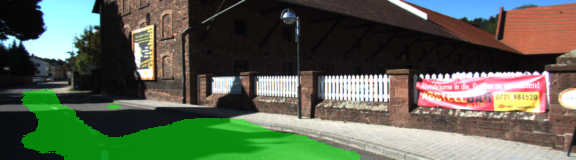
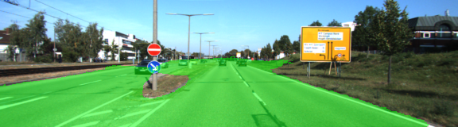
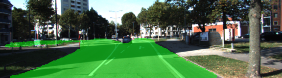
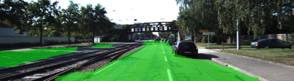
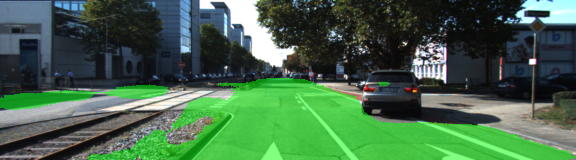
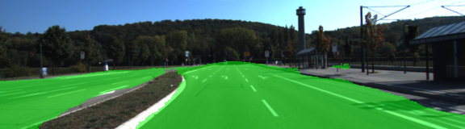
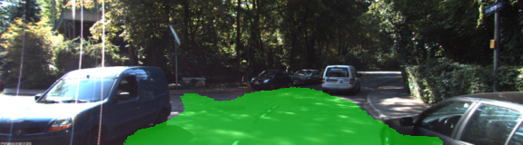

Results are quite good. However segmentation is not satisfactory on shaded areas. For cope with it, image augmentation should be performed.

## Setup
### Frameworks and Packages
The following libraries are required:
 - [Python 3](https://www.python.org/)
 - [TensorFlow](https://www.tensorflow.org/)
 - [NumPy](http://www.numpy.org/)
 - [SciPy](https://www.scipy.org/)

### Training set
We use the [Kitti data](http://www.cvlibs.net/datasets/kitti/eval_road.php) set which is available [here]( http://www.cvlibs.net/download.php?file=data_road.zip). The road and lane estimation benchmark consists of 289 training and 290 test images. Ground truth has been generated by manual annotation of the images and is available for two different road terrain types: road - the road area, i.e, the composition of all lanes, and lane - the ego-lane, i.e., the lane the vehicle is currently driving on (only available for category "um"). 
For this project, only two labels are considered : road / non road. That is the ego-lane label has been discarded.

### Input model
The VGG-16 model used for this project can be downloaded [here]( https://s3-us-west-1.amazonaws.com/udacity-selfdrivingcar/vgg.zip).

